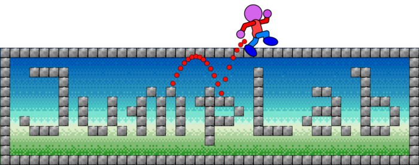

# JumpLab: a testbed for studying jump motion and scrolling algorithms of videogames

## Introduction

JumpLab is a software that allows you to experiment with variable parameters for jumping and camera
movement in platform games (jump action games) such as Super Mario Bros. It is designed as an
educational tool for learning how parameter settings affect the sense of playing in video games.

Please visit <https://fukuchi.org/works/jumplab/> for further information.

## Quick note

  - [Processing](https://processing.org/) 3 or higher is required.
  - Install [ControlP5](https://www.sojamo.de/libraries/controlP5/) and [Game Control Plus](http://lagers.org.uk/gamecontrol/) from "Add Library..." from the "Import Library..." menu.
  - Press left/right arrow keys to move left/right, and space key to jump.

## TODO

  - Dash button
  - Sound effects
  - Level selector / level editor
  - Double jump
  - Vertical forward focus
  - Terminology check

## LICENSE

JumpLab is released under the terms of the GNU GPL 3.0.

JumpLab: a testbed for studying jump motion and scrolling algorithms of videogames

Copyright (C) 2020, 2021 Kentaro Fukuchi and other contributors

This program is free software: you can redistribute it and/or modify it under the terms of the GNU General Public License as published by the Free Software Foundation, either version 3 of the License, or (at your option) any later version.

This program is distributed in the hope that it will be useful, but WITHOUT ANY WARRANTY; without even the implied warranty of MERCHANTABILITY or FITNESS FOR A PARTICULAR PURPOSE. See the GNU General Public License for more details.

You should have received a copy of the GNU General Public License along with this program. If not, see <https://www.gnu.org/licenses/>.
